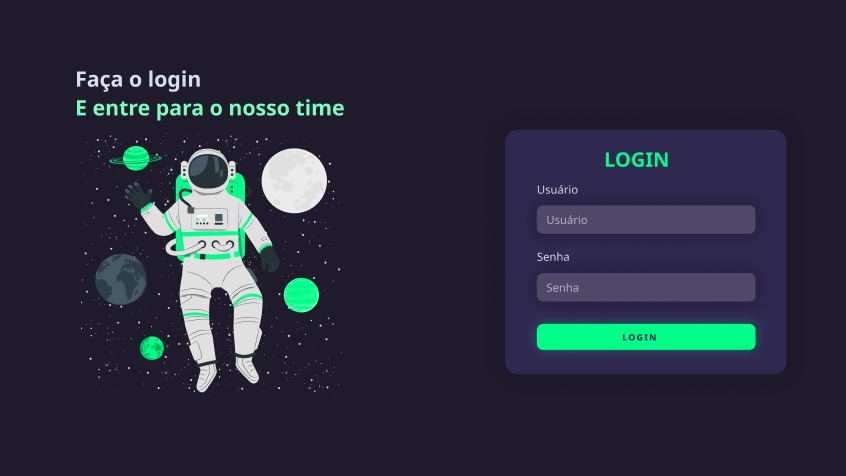

# Projeto-Tela-de-login

<h1 align="center"> Tela de login </h1>

  <a href="#-tecnologias">Tecnologias</a>&nbsp;&nbsp;&nbsp;|&nbsp;&nbsp;&nbsp;
  <a href="#-projetos">projetos</a>&nbsp;&nbsp;&nbsp;|&nbsp;&nbsp;&nbsp;
  <a href="#-layout">Layout</a>&nbsp;&nbsp;&nbsp;|&nbsp;&nbsp;&nbsp;
  <a href="#memo-licença">Licença</a>

  

 

## 🚀 Tecnologias 

- HTML e CSS
- Git e Github 
- Figma

## 💻 Projeto

Tela de login criativa

- [Acesse o projeto online aqui](https://github.com/mateustomaz1/Projeto-Tela-de-login)

## 📝 Layout 

Você pode vizualizar o layout através [DESSE LINK](https://www.figma.com/file/0MGon9UnCYr8QBxiheaQ4V/Untitled?type=design&node-id=0-1&mode=design&t=wGvMk5SXKB4YFeDD-0) É necessário ter conta no [Figma](https://www.figma.com) para acessá-lo.

## :memo: Licença

Esse projeto está sob a licença MIT.
